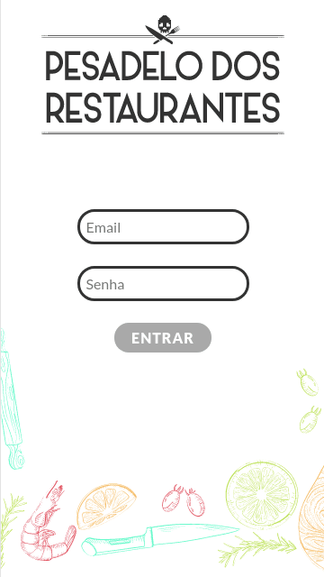
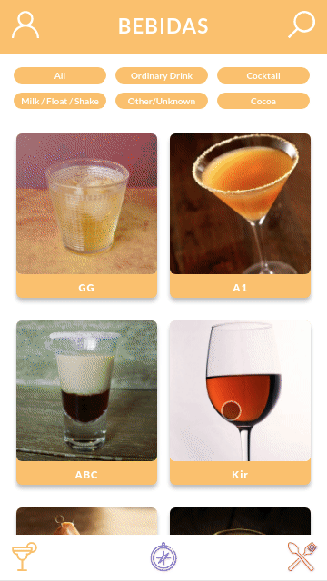
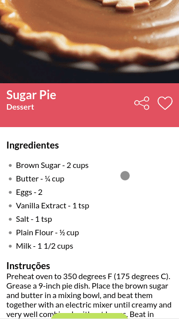
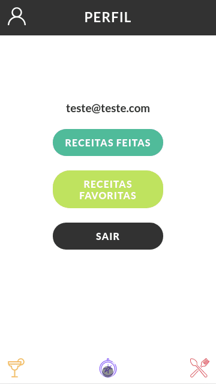
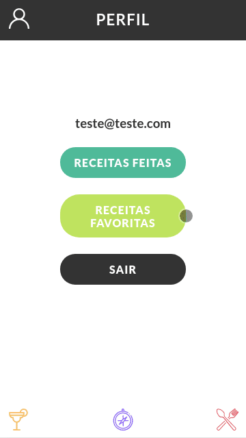

# Projeto Aplicativo de Receitas

Desenvolvimento de um app de receitas, utilizando o que há de mais moderno dentro do ecossistema React: Hooks e Context API! Nele é possível ver, buscar, filtrar, favoritar e acompanhar o processo de preparação de receitas e drinks!

A base de dados com 2 APIs distintas, uma para comidas e outra para bebidas.

O layout com foco dispositivos móveis, então todos os protótipos vão estar desenvolvidos em telas menores.

 <a href="https://diogoaugusto.dev/recipes-app/">Clique aqui para conferir o Deploy.</a>

 

### 🛠 Tecnologias e Ferramentas Utilizadas:

- [x] REACT
- [x] CONTEXT API
- [x] HOOKS
- [x] RTL
- [x] SPA
- [x] API
- [x] ESLINT
- [x] ROUTER
- [x] HTML5
- [x] CSS3

### 💻 Desenvolvedores:

- [Diogo Augusto](https://github.com/diogotrescastro)

- [Gabriel Castro](https://github.com/GabriellCastro/)

- [Guilherme Pereira](https://github.com/guidpo0)

- [Julio Thosi](https://github.com/thosijulio)
 
- [Thiago Cavalcante](https://github.com/Thiagofox)

 ### <a href="https://diogoaugusto.dev/" target="blank">👉 Clique e Confira meu Portfólio</a>

 ### 🤝 Conecte-se Comigo:

